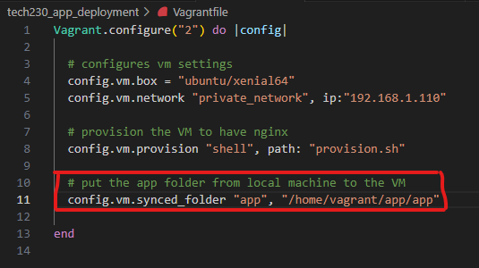
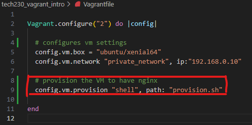
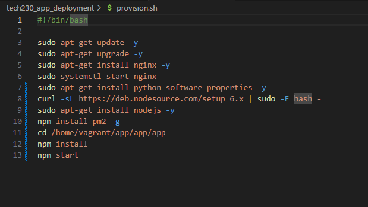
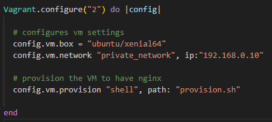
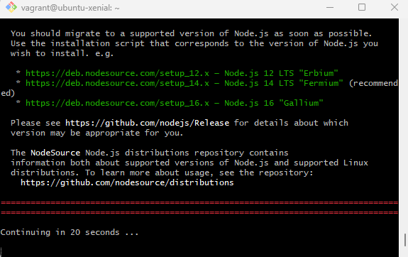
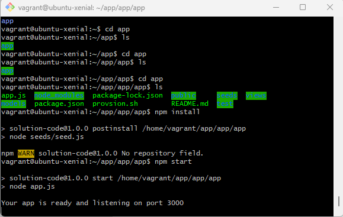
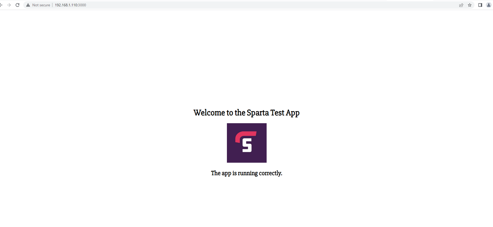

# A Guide on how to deploy the Sparta App

## Pre Deployment Configuration

You will need to add some configuration first to make sure the app folder gets added to the virtual machine and nginx installation is automated. You can do this by following the step below:

1. Add `config.vm.synced_folder "app", "/home/vagrant/app/app"` to your Vagrantfile. This should look like this:

2. Add `config.vm.provision "shell", path: "provision.sh"` to the existing configuration in Vagrantfile, This should look like this:

3. `touch provision.sh` - Run this command in the terminal to create a new file in the current directory. This file will include the shell script that is to be run when we enter our virtual machine. The script should look like this:

## Running the VM

Follow the steps below to setup your Virtual Machine before deploying the app.

1. `vagrant destroy` (This will delete any existing virtual machine and it's files within current directory)

2. `vagrant up` (creates a new virtual machine. you can check this in virtual box to make sure a new virtual machine with appropriate name is added)

3. `vagrant ssh`. This will allow you to enter the virtual machine that was just created.
NOTE: working directory in bash terminal will change to `vagrant@ubuntu/xenial64` or any other box you have configured for in Vagrantfile. This should look like this:

## Pre Deployment Test Check

Follow the steps below to ensure all the tests work ok before deploying the app

## Deploying the App

1. `sudo apt-get install python-software-properties`
2. `curl -sL https://deb.nodesource.com/setup_6.x | sudo -E bash -`. It should look like this and it will prompt you to run command in step 3 after execution.

3. `sudo apt-get install nodejs -y` - To installl nodejs

4. In VM, run `cd app` to make sure all app files are accessible.
5. `npm install` - This will install node package manager to ensure all required package for running the app are downloaded.
6. `npm start` - To run the app, you should see the following message in your VM terminal:

7. `192.168.1.110` - Nginx web server can be accessed by entering this IP address in the web browser.

8. `192.168.1.110:3000` - Deployed version of the app can be viewed by entering this address in the browser. This should look like this:

